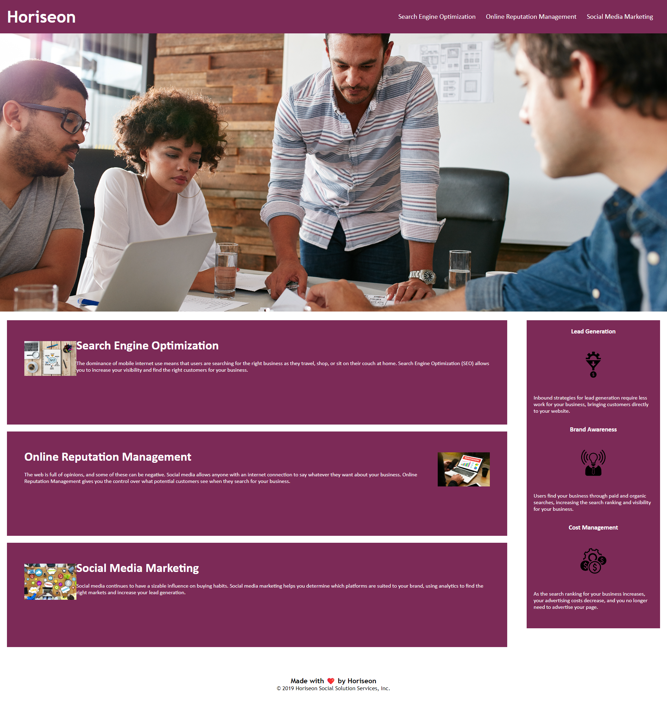

# Marketing Website Redesign

## Description 
This piece work is a demonstration of the capabilities of HTML and CSS. The aim of this work is to showcase the flexibility of HTML and CSS, showing how they work together to create a deliverable final product. In working with the HTML code, I have been able to manipulate the final design of the page using CSS classes and HTML elements.

### Preview

#### Website Link
file:///C:/Users/Alan/Assignment-Repos/Module-1-Assignment/Assignment-1-Website-Redesign/starter/index.html#social-media-marketing